<!-- Hi, I'm Hemnaath — AI / ML Engineer -->

  

  
  
  

AI engineer building LLM-driven, agentic systems. I ship autonomous applications, dataset-scoped retrieval, and production LLM products in Python, and I run them on my own infrastructure.

📍 Boston, MA · CS MS @ Northeastern Khoury (Jan 2026 to May 2028)
🛠️ **Open for co-op: January 2027**

---

### 🚀 What I'm building right now

**[RoleReveal](https://github.com/hemnaath04/rolereveal)** · [rolereveal.app](https://rolereveal.app)
A shipped Chrome extension (MV3) that scores any job posting against your resume, with an inline match score, verdict, and skill gaps. Works across LinkedIn, Indeed, and any job site through per-site and universal adapters. Backed by a key-hiding LLM proxy on Vercel Edge with per-user rate limits, and all resume text is PII-masked before it leaves the browser.

**[ClaimFarm](https://github.com/hemnaath04/claimfarm)**
An AI agent that turns a smallholder farmer's WhatsApp photo into a filed crop-insurance claim. Vision-grounded damage assessment plus an agentic filing pipeline. Built for the Qwen Cloud hackathon (Track 4).

**[BedRocked](https://github.com/hemnaath04/bedrocked)** · [Live demo](https://sewershed-bedrocked.vercel.app)
Ranks Somerville's combined-sewer streets by dig-readiness to sequence a $1.29B separation program, pairing Cyvl street-scan data with city GIS on an interactive map. Built at the Cyvl × Autodesk × NVIDIA × City of Boston Physical-AI Hackathon.

**Job-OS** · [Live demo](https://job-app-manager-five.vercel.app)
A personal job-search platform: application tracker, profile-grounded resume tailoring, and multi-source job discovery. FastAPI and LangGraph backend with an agentic pipeline that grounds every resume in real profile data, no invented experience.

---

### 🧠 What I work with

**Languages** Python · Swift · Java · Bash
**AI / ML** LLM orchestration · agentic systems · RAG / vector retrieval · knowledge distillation · prompt engineering · embeddings · PyTorch · scikit-learn
**Backend** FastAPI · async SQLAlchemy · PostgreSQL (+ pgvector) · MongoDB · REST APIs · streaming pipelines
**Infra** Docker · Render · Vercel · Cloudflare R2 · Alembic

---

### 🧪 Background

Previously at **EPAM** as a Test Automation Engineer on the Fares client, where I built CI-grade automation suites end to end. Now focused on applied AI / ML and LLM systems.

---

### 📊 Activity

  

  

---

<i>From <a href="https://github.com/hemnaath04/rolereveal">RoleReveal</a>: "Track every application. Score every job. Never lie on your CV."</i>
