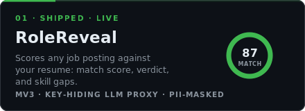
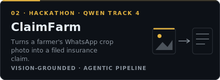
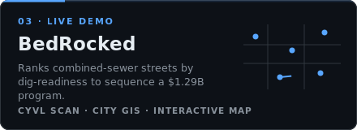
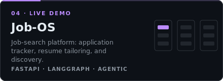

<!-- Hi, I'm Hemnaath — AI / ML Engineer -->

  

  
  
  

AI engineer building LLM-driven, agentic systems. I ship autonomous applications, dataset-scoped retrieval, and production LLM products in Python, and I run them on my own infrastructure.

📍 Boston, MA · CS MS @ Northeastern Khoury (Jan 2026 to May 2028)
🛠️ **Open for co-op: January 2027**

---

### Selected work

<table>
  <tr>
    <td width="50%" valign="top">
      
      
<a href="https://rolereveal.app">Live ↗</a> &nbsp;·&nbsp; <a href="https://github.com/hemnaath04/rolereveal">Repo ↗</a>

    </td>
    <td width="50%" valign="top">
      
      
<a href="https://claimfarm-dashboard.vercel.app">Live ↗</a> &nbsp;·&nbsp; <a href="https://github.com/hemnaath04/claimfarm">Repo ↗</a>

      

    </td>
  </tr>
  <tr>
    <td width="50%" valign="top">
      
      
<a href="https://sewershed-bedrocked.vercel.app">Live ↗</a> &nbsp;·&nbsp; <a href="https://github.com/hemnaath04/bedrocked">Repo ↗</a>

    </td>
    <td width="50%" valign="top">
      
      
<a href="https://job-app-manager-five.vercel.app">Live ↗</a>

    </td>
  </tr>
</table>

---

### 🧠 What I work with

**Languages** Python · Swift · Java · Bash
**AI / ML** LLM orchestration · agentic systems · RAG / vector retrieval · knowledge distillation · prompt engineering · embeddings · PyTorch · scikit-learn
**Backend** FastAPI · async SQLAlchemy · PostgreSQL (+ pgvector) · MongoDB · REST APIs · streaming pipelines
**Infra** Docker · Render · Vercel · Cloudflare R2 · Alembic

---

### 🧪 Background

Previously at **EPAM** as a Test Automation Engineer on the Fares client, where I built CI-grade automation suites end to end. Now focused on applied AI / ML and LLM systems.

---

### 📊 Activity

  

  

---

<i>From <a href="https://github.com/hemnaath04/rolereveal">RoleReveal</a>: "Track every application. Score every job. Never lie on your CV."</i>
