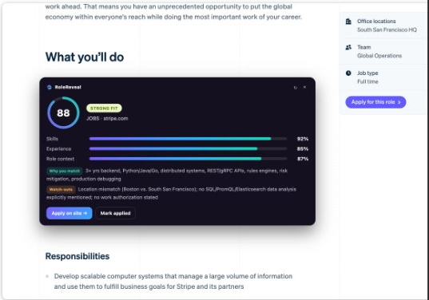
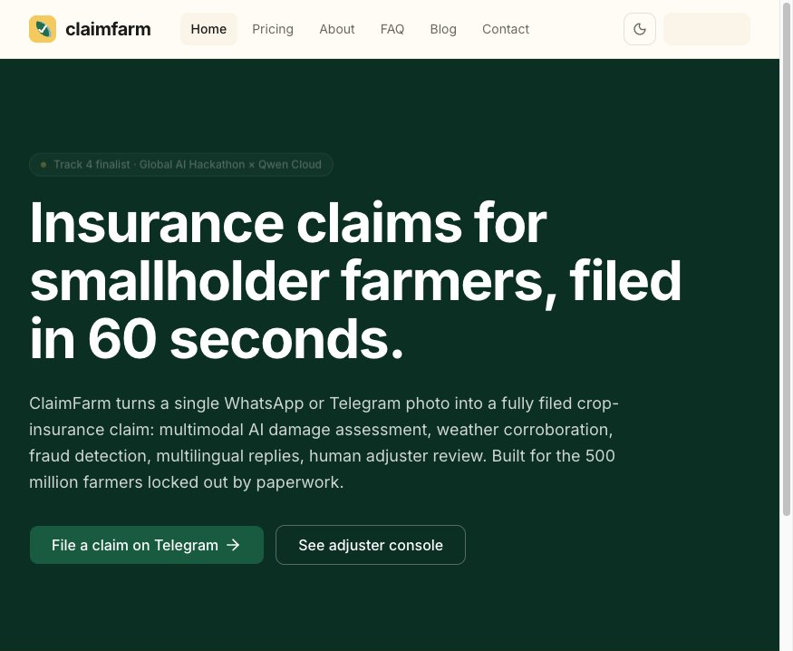
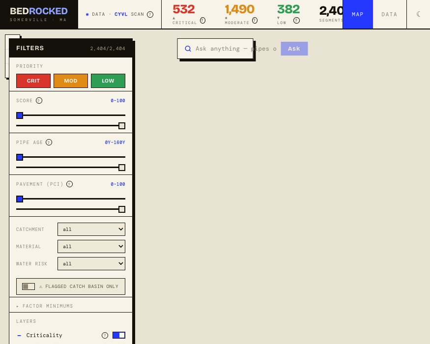

<!-- Hi, I'm Hemnaath, AI / ML Engineer -->
# Hemnaath

  
  
  

I build LLM-driven, agentic systems, mostly in Python, and I run what I build on my own infrastructure instead of just demoing it. Right now that's [job.os](https://jobs.hemnaath.tech): a job-search platform whose resume agent can only write what a verified fact already backs up.

Boston, MA · CS MS @ Northeastern Khoury (Jan 2026 to May 2028)
**Open for co-op: January 2027**

---

### Why AI

I came to AI through testing. My last stretch at EPAM was spent building agents that generated test cases straight from functional requirements documents. It was the first system I'd worked on that wrote artifacts instead of checking mine, and the reason I moved into AI/ML full time.

The testing habit came with me. Most LLM products ask a model to be honest in a prompt and hope. job-os enforces it in code: unverified numbers are stripped after generation, new entities are rejected outright, and a resume version can't be finalized until it clears a deterministic score with no blocking issues. That's a test suite pointed at a model, and it's the thing I actually care about building.

---

### Selected work

#### 💼 job-os
*"Track every application. Tailor every resume. Never lie on your CV."* Every claim the resume agent writes has to trace back to something already verified, enforced in code rather than a prompt asking the model to behave.
[Live ↗](https://jobs.hemnaath.tech) &nbsp;·&nbsp; [Repo ↗](https://github.com/hemnaath04/job-os)

#### 🔍 RoleReveal
Chrome extension that scores any job posting against your resume inline, masking your personal details before anything reaches the model.
[Live ↗](https://chromewebstore.google.com/detail/oplfnlcnahoijcflpjjncplkoakdpobb) &nbsp;·&nbsp; [Repo ↗](https://github.com/hemnaath04/rolereveal)

#### 🌾 ClaimFarm
Turns a smallholder farmer's WhatsApp crop photo into a filed insurance claim, cross-checking weather data and photo forensics before a human adjuster signs off.
[Live ↗](https://claimfarm-dashboard.vercel.app) &nbsp;·&nbsp; [Repo ↗](https://github.com/hemnaath04/claimfarm)

#### 🗺️ BedRocked
Scores Somerville's 2,404 combined-sewer segments for dig-readiness by joining city GIS data to Cyvl's street-scan data, built at a 2026 hackathon.
[Live ↗](https://sewershed-bedrocked.vercel.app) &nbsp;·&nbsp; [Repo ↗](https://github.com/hemnaath04/bedrocked)

---

### What I work with

**Languages** Python · Java · Bash
**AI / ML** LLM orchestration · agentic systems · RAG / vector retrieval · knowledge distillation · prompt engineering · embeddings
**Backend** FastAPI · LangGraph · Appwrite · async SQLAlchemy · PostgreSQL (+ pgvector) · MongoDB · REST APIs
**Infra** Docker · Render · Vercel · Appwrite Cloud · Cloudflare R2 · Alembic · LaTeX / Tectonic

---

### Background

Previously at **EPAM** as a Test Automation Engineer on the Fares client, where I built CI-grade automation suites end to end. Now focused on applied AI / ML and LLM systems.

---

### Activity

  

