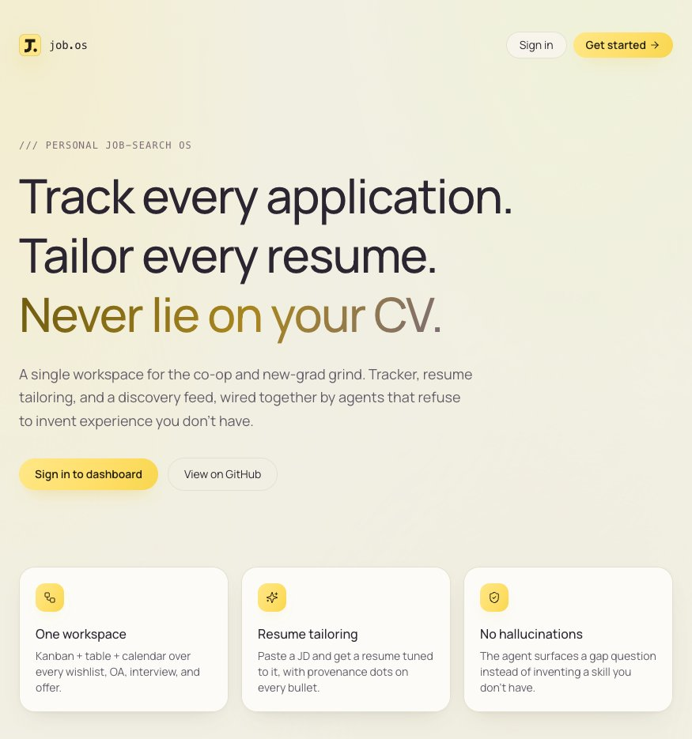

# Hemnaath Balasubramani

**AI/ML engineer. I build agentic LLM systems — and the harnesses that prove they work.**

  
  
  

> 🟢 **Open for a Spring 2027 co-op — January to June 2027.** Applied AI · LLM engineering · AI evaluation & reliability.
> Boston, MA · MS Computer Science @ Northeastern Khoury · Work-authorized for co-op via CPT, no sponsorship required.

---

### Why me

I came to AI through testing. My last stretch at **EPAM** was building agents that generated test cases straight from functional requirements documents — the first system I'd worked on that wrote artifacts instead of checking mine. That's why I moved into AI/ML full time, and the testing habit came with me.

Most LLM products ask a model to be honest in a prompt and hope. [job-os](https://jobs.hemnaath.tech) enforces it in code: unverified numbers are stripped after generation, new entities are rejected outright, and a resume version can't be finalized until it clears a deterministic score with zero blocking issues. That's a test suite pointed at a model, and it's the work I want to do.

Everything below runs on infrastructure I deploy and maintain. None of it is a demo notebook.

---

### Selected work

#### 💼 [job-os](https://github.com/hemnaath04/job-os) — *"Track every application. Tailor every resume. Never lie on your CV."*
A job-search platform whose resume agent physically cannot write a claim that isn't traceable to a verified fact. Grounding is enforced by a post-generation validation pass, not by asking the model nicely.
**Python · FastAPI · LangGraph · PostgreSQL + pgvector · Docker**
[Live ↗](https://jobs.hemnaath.tech) · [Repo ↗](https://github.com/hemnaath04/job-os)
<!-- TODO: add one number here — applications tracked, resumes generated, or hallucination rate before/after the validator. Numbers are the single biggest upgrade you can make to this section. -->

| Project | What it does | Links |
|---|---|---|
| 🔍 **RoleReveal** | Chrome extension that scores any job posting against your resume inline, masking personal details before anything reaches the model. | [Chrome Store ↗](https://chromewebstore.google.com/detail/oplfnlcnahoijcflpjjncplkoakdpobb) · [Repo ↗](https://github.com/hemnaath04/rolereveal) |
| 🌾 **ClaimFarm** | Turns a smallholder farmer's WhatsApp crop photo into a filed insurance claim — cross-checking weather data and photo forensics before a human adjuster signs off. | [Live ↗](https://claimfarm-dashboard.vercel.app) · [Repo ↗](https://github.com/hemnaath04/claimfarm) |
| 🗺️ **BedRocked** | Scores Somerville's 2,404 combined-sewer segments for dig-readiness by joining city GIS data to street-scan LiDAR. Built at a 2026 hackathon. | [Live ↗](https://sewershed-bedrocked.vercel.app) · [Repo ↗](https://github.com/hemnaath04/bedrocked) |

---

### Stack

**Core** Python · FastAPI · LangGraph · PostgreSQL (+ pgvector) · Docker
**AI/ML** LLM orchestration · agentic systems · RAG & vector retrieval · evaluation harnesses · embeddings
**Also** Java · MongoDB · async SQLAlchemy · Appwrite · Cloudflare R2 · Vercel / Render

---

### Background

**EPAM Systems** — Test Automation Engineer, ride-hailing fares platform (2024–2025). Built CI-grade automation suites end to end in Go and Java; finished on an internal agent that generated test cases from requirements docs.
**Northeastern University** — MS Computer Science, Khoury College (Jan 2026 – May 2028). Coursework in reinforcement learning and NLP.

---

### Hiring for an AI/ML or evals role?

I'm looking for a **Spring 2027 co-op**. The fastest way to reach me is
📧 **balasubramani.h@northeastern.edu** — or [LinkedIn](https://linkedin.com/in/hemnaath04).
